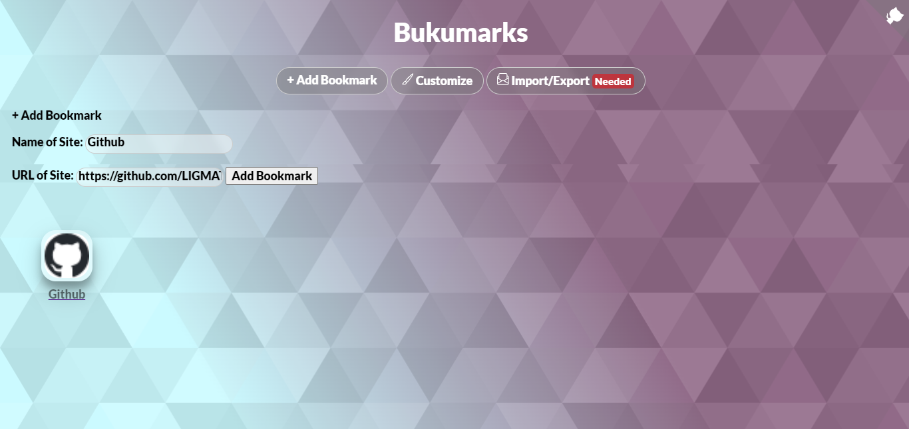
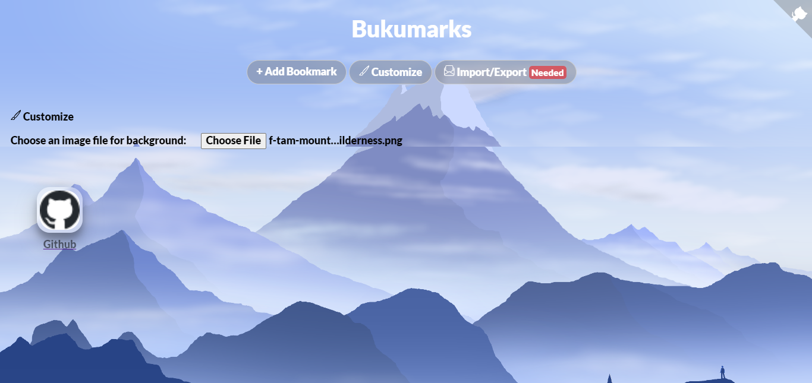
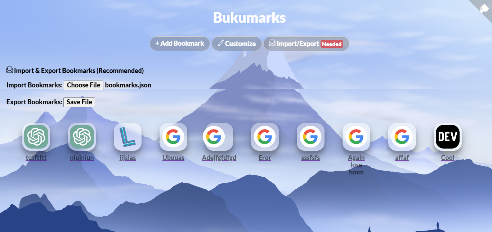
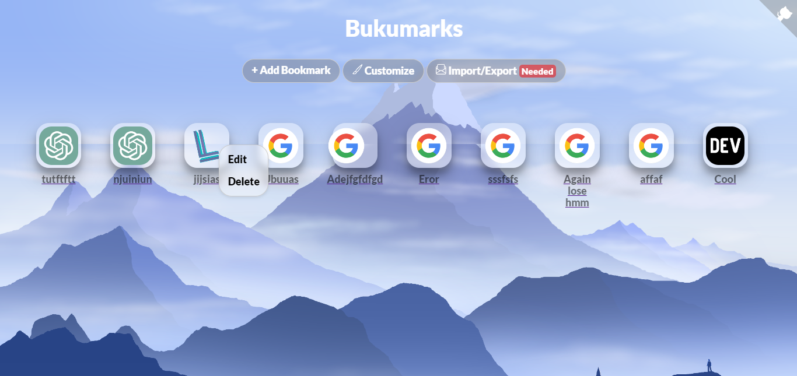
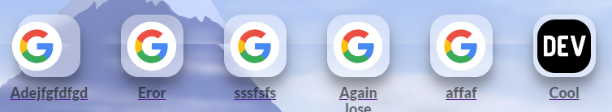
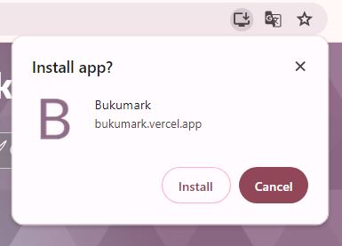

  

## Table of Content
*   
*   
*   
*   
*   
* 

#### Bookmark manager that keep you simple with beautiful UI  

> [!TIP]
>   
> Latest screenshot, captured by [Thum.io](https://www.thum.io/)

# Features

### + Add Bookmark
Easily make an Bookmark.

### 🖌 Customize
Customize your wallpaper. yeah.  
*[Get some beautiful wallpaper here](https://minimalistic-wallpaper.demolab.com/)*

### 🗎 Import/Export
Export your bookmarks easily on a button.

# ❇ More features

### ☰ Context Menu
Right click, Edit name or Delete.

### 🖼 Favicon
An bookmark without icon is bored.  
*Using https://www.google.com/s2/favicons?domain=example.com&sz=128*

### ⬇️ PWA
Install Bukumark as app, powered by PWA.  

# ▲ Deploy your own

