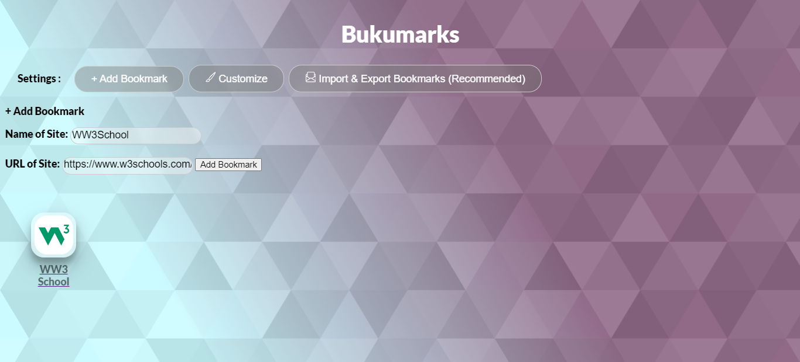
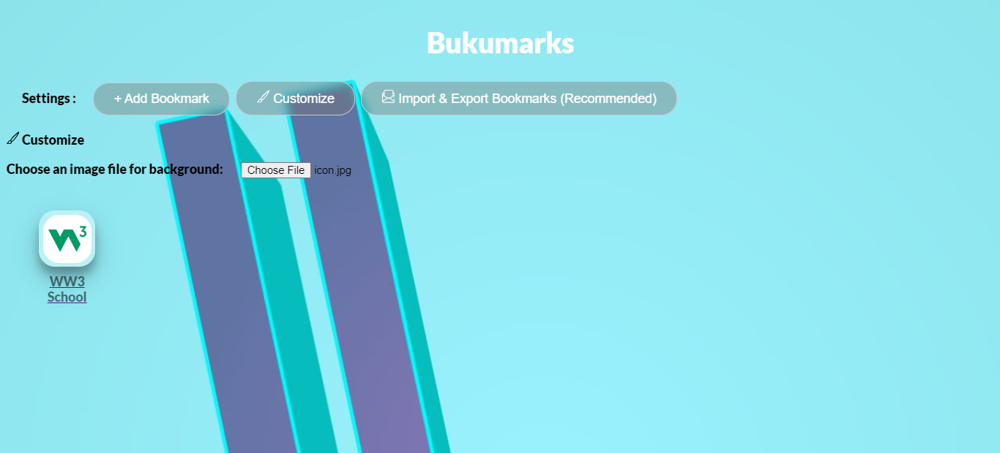
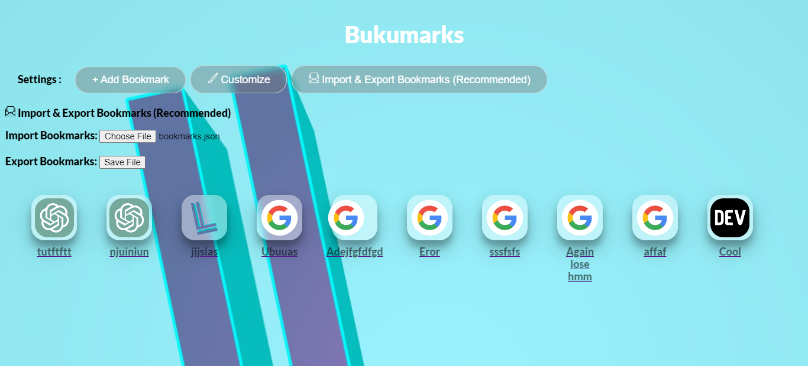
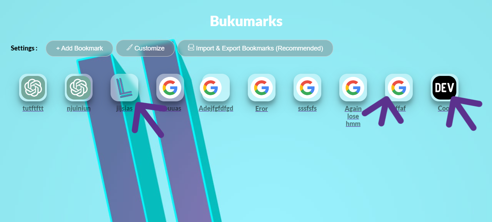

# Bukumark 🕮
Bookmark manager that keep you simple with beautiful UI  
⚠ Please read until end before using it. (That short)

# Features 🕮

### + Add Bookmark
Easily make an Bookmark.

### 🖌 Customize
Customize your wallpaper. yeah.

### 🗎 Import & Export Bookmarks (Recommended)
You not want your bookmarks gone yeah? So PLEASE EXPORT.

# ❇ More features

### ☰ Context Menu
Right click, Edit name or Delete.

### 🖼 Favicon
An bookmark without icon is bored.  
*Using https://www.google.com/s2/favicons?domain=example.com&sz=128*

# 

# Open Source
Check the source code of Bukumark [here!](https://raw.githubusercontent.com/LIGMATV/Bukumark/main/index.html)
